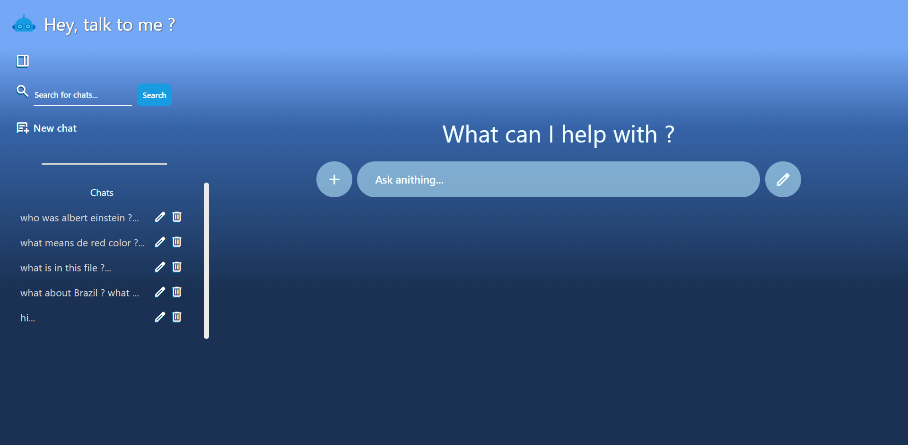
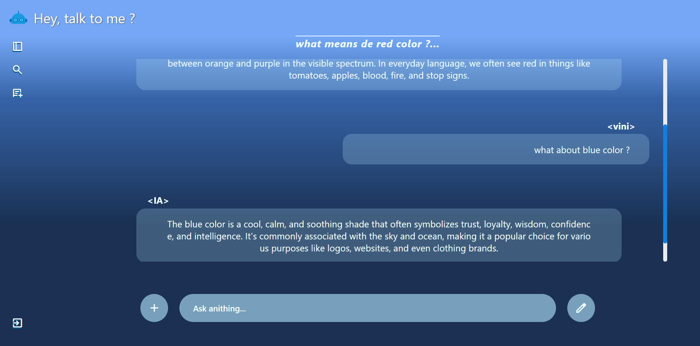

# 💬 TalkToMe — Website para conversar com uma LLM local (Ollama Mistral)

O **TalkToMe** é um website moderno para **conversar com uma LLM rodando localmente** através do **Ollama Mistral**, oferecendo uma experiência parecida ao próprio ChatGPT, mas **100% local e privada**.  





## 🌟 Propósito desse projeto

Criado para que qualquer pessoa possa rodar uma inteligência artificial no próprio computador, sem depender de serviços externos.  
Isso garante **segurança, independência e flexibilidade** para estudos, experimentos ou uso diário.

- 🔒 **Privacidade** - nada sai da sua máquina.
- ⚡ **Rapidez** - sem latência de rede externa.
- 🛠️ **Controle total** - personalizável e extensível.
- 💻 **Open-source** - feito para aprender, colaborar e evoluir.




## 🛠️ Funcionalidades principais

### 👤 Usuário comum

- **Cadastro e login** - autenticação segura com JWT.
- **Conversar com a LLM** - envie mensagens e receba respostas da IA.
- **Histórico de conversas** - visualize interações anteriores.
- **Interface intuitiva** - acesso simples direto do navegador.

### ⚙️ Administrador - (tarefas futuras)

- **Monitorar consumo** - acompanhar estatísticas de uso. (implementação futura)
- **Configurar modelos** - escolher entre diferentes LLMs disponíveis no Ollama. (implementação futura)


## 💥 Destaques técnicos

- **🔐 Autenticação segura** - JWT + Bcrypt.
- **🗂️ Estrutura organizada** - separação clara entre services, controllers e middlewares.
- **📊 Sequelize (MySQL)** - gerenciamento de usuários e histórico de conversas.
- **⚡ Integração direta com Ollama** - comunicação local via API.
- **📝 Testes automatizados** - Jest + Supertest no backend.
- **🖥️ Frontend moderno** - React + Vite.


## 🖥️ Tecnologias utilizadas

### 🖼️ Frontend (React + TypeScript)
- **React 19 + Vite** - desenvolvimento rápido e moderno.
- **React Router DOM 7** - navegação SPA.
- **Axios** - integração com o backend.

### 🔧 Backend (Node.js + TypeScript)
- **Express 5** - API REST robusta.
- **Sequelize (MySQL2)** - ORM para usuários e conversas.
- **UUID** - identificadores únicos.
- **JWT + Bcrypt** - autenticação e segurança.
- **Dotenv** - variáveis de ambiente.
- **Jest + Supertest** - testes automatizados.

### 🤖 Integração com LLM
- **Ollama Mistral** rodando localmente.
- **Axios** - comunicação entre backend e Ollama API.


## 🚀 Como rodar o projeto localmente

### 🛠️ 1. Pré-requisitos

Antes de começar, instale:

- **Node.js** (LTS recomendado)
- **MySQL**
- **Ollama** (com o modelo **Mistral** já baixado)
- **Git** (opcional, mas recomendado)

> ⚠️ Instalação do Ollama e modelo Mistral:
```bash
curl -fsSL https://ollama.com/install.sh | sh
ollama pull mistral
```


### Clonando o repositório
```bash
- git clone https://github.com/seu-usuario/TalkToMe.git
```

### Acesse a pasta do projeto
```bash
- cd TalkToMe
```

### Configurar o backend
```bash
- cd backend
- npm install
- npm run build
- npm run start
```

### Abra o MySQL e crie um banco de dados para o projeto:
```bash
- CREATE DATABASE talktome;
```

### Configure o arquivo .env na raiz do backend:
```bash
- DB_NAME=talktome
- DB_USER=seu_usuario
- DB_PASSWORD=sua_senha
- JWT_SECRET=sua_chave_jwt
```

### Execute as migrações
```bash
- npx sequelize db:migrate
```

### Configurar o frontend
```bash
- cd frontend
- npm install
- npm run dev
```

### Por padrão, o Vite irá rodar o frontend em:
```bash
- http://localhost:5173
```


## 🌍 Acessando a aplicação
### Abra o navegador e vá até:
```bash
- http://localhost:5173/login
```
